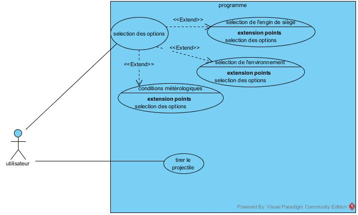
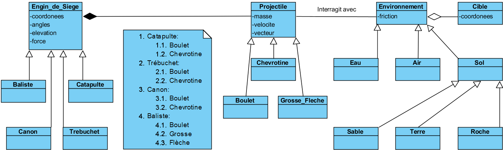

## Modèles

#### Cas d'utilisation (DCU)
Dans le cas du programme de tests balistiques, l’acteur principal est l’utilisateur: c’est lui qui décidera des paramètres.  

Ces paramètres consistent du terrain: terre, eau, sable, roche; De l’engin de siège tel qu’une catapulte, un trébuchet, une baliste et un canon; Du type de projectile: les flèches, les boulets et les chevrotines; De l’angle de tir ainsi que l'élévation de l’arme. Toutes ces options affectent la trajectoire des projectiles. Finalement, une option pour visualiser l’arc de tir est également disponible.  

#### Séquence système (DSS)

#### Conceptuel des données (MCD)

#### Classes

