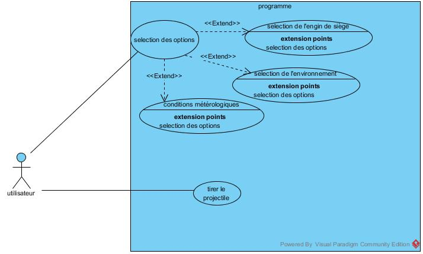
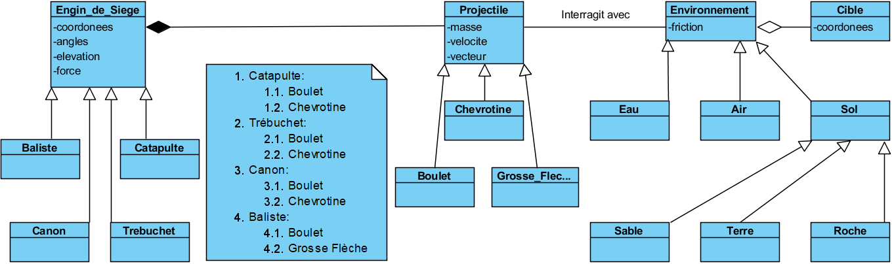

# Simulateur ballistique
Projet de session en 420-AW6 - Développement de projets  
par Nicolas Bazinet, Marc-Antoine Barabé, Samuel Therrien et Simon Nguyen  

## Vision et étude de faisabilité
La vision du projet consiste en une application pour simuler des tirs sous différentes paramètres affectant le tir. L’utilisateur, mis en charge de la simulation, pourra modifier ces paramètres à son choix à partir de l’interface d’utilisateur constitué d’un menu dynamique.  

Le projet sera réalisé à l'aide de Unity version 5.6.x qui est reconnu pour son moteur de physique intégré, dynamique et polyvalent. Le déploiement se fera sur Windows 10 et Mac OS 10.13 (High Sierra).

[Cycle de développement et Rapport d'analyse](https://docs.google.com/document/d/1KkV5PzfKP5J1mMFA_SUoL8Q6cWs6PHw5FupHfbu4PL4/edit?usp=sharing)

## Modèles
[Glossaire](Documentation/Glossaire.md)
#### Cas d'utilisation
Dans le cas du programme de tests balistiques, l’acteur principal est l’utilisateur: c’est lui qui décidera des paramètres.  

Ces paramètres consistent du terrain: terre, eau, sable, roche; De l’engin de siège tel qu’une catapulte, un trébuchet, une baliste et un canon; Du type de projectile: les flèches, les boulets et les chevrotines; De l’angle de tir ainsi que l'élévation de l’arme. Toutes ces options affectent la trajectoire des projectiles. Finalement, une option pour visualiser l’arc de tir est également disponible.  

#### Classes

